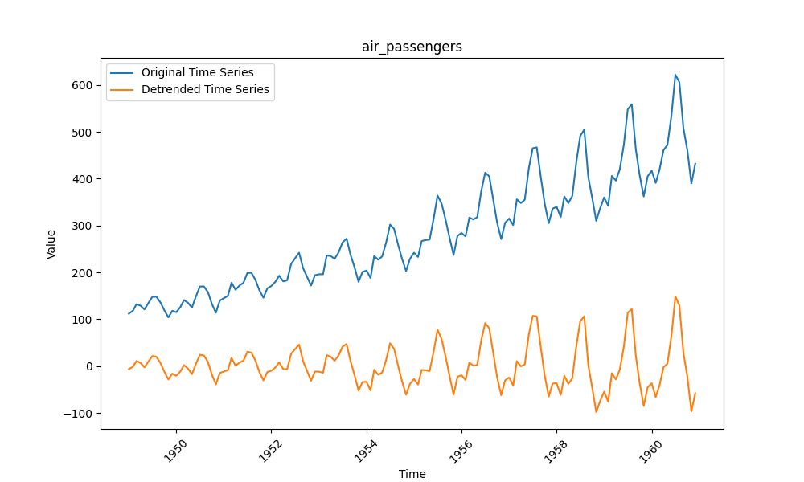
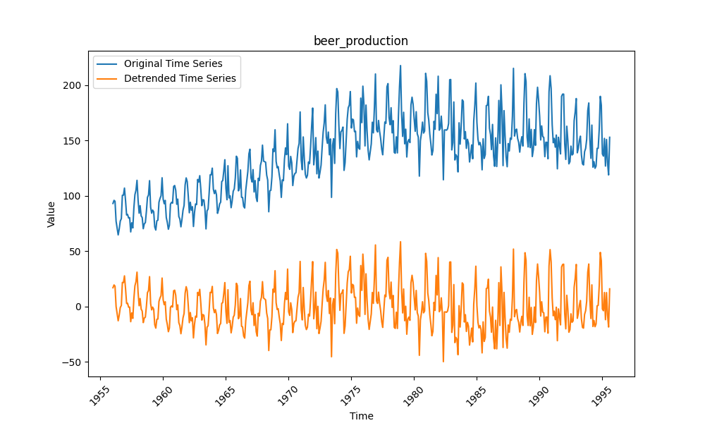
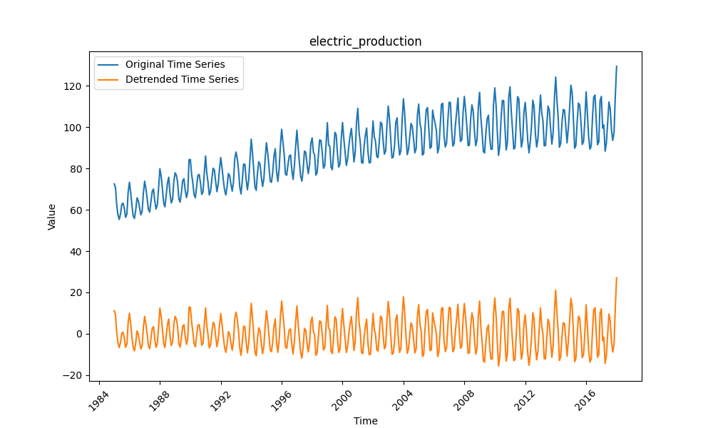
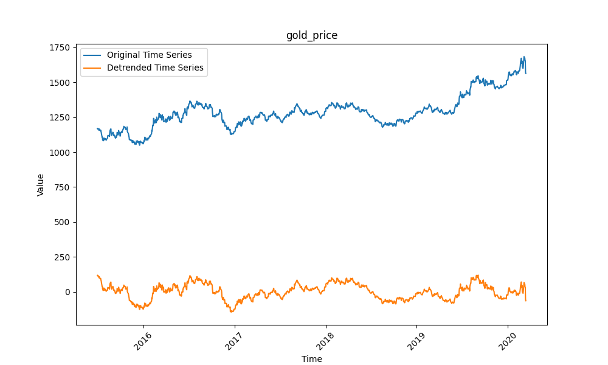
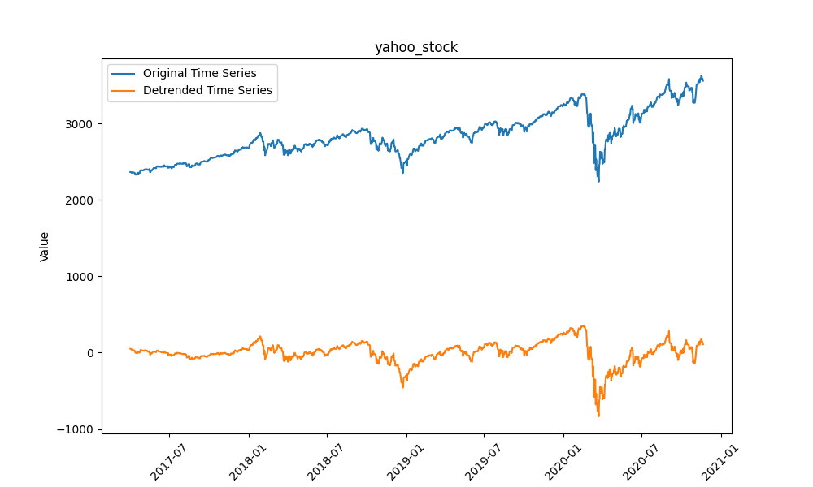
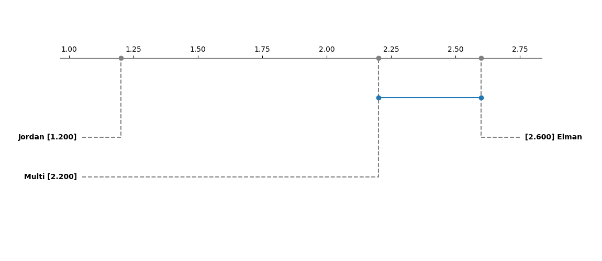

# Comparative Analysis of Recurrent Neural Network Architectures

This repo contains the supplementary code for a report on comparing the effectiveness of three different recurrent neural network (RNN) architectures—**Elman RNN**, **Jordan RNN**, and **Multi-RNN**—for time series forecasting. The various RNN architectures were implemented by hand in python using numpy. This project evaluates the effectiveness of these architectures across various time series datasets, highlighting the best performing models and offering insights into their application for real-world forecasting tasks.

## Project Overview

In this project, I aimed to analyze the performance of different RNN models to tackle both stationary and non-stationary time series data. I focused on exploring how different architectures, data preprocessing steps, and hyperparameter tuning affect forecasting accuracy.

### Key Architectures Analyzed:
- **Elman RNN:** Captures temporal dependencies with recurrent connections from the hidden layer.
- **Jordan RNN:** Utilizes feedback loops from the output layer to enhance long-term dependencies.
- **Multi-RNN:** Combines elements from both Elman and Jordan architectures, creating a hybrid approach.

### Datasets:

Five diverse time series datasets were used to evaluate the architectures, the original time series and the detrended time series are shown below:

- **Air Passengers:** Monthly total passengers from 1949 to 1960.

- **Beer Production:** Monthly beer production in Austria.

- **Electricity Production:** Monthly electricity production.

- **Gold Price:** Daily gold price fluctuations.

- **Yahoo Stock:** Daily closing prices of Yahoo stock.

## Methodology

### Data Preprocessing

To prepare the data for the models, the following steps were applied:

**Detrending:** Polynomial regression was used to remove long-term trends from the data, converting it to stationary form.
**Normalization:** Min-Max scaling was applied to normalize the data, ensuring efficient convergence during training.

### Hyperparameter Tuning
A grid search was performed to fine-tune the following parameters:

- Input size
- Hidden size
- Learning rate
- Number of epochs

### Evaluation Metrics:

The models were evaluated based on the following metrics:

- **Mean Squared Error (MSE):** Measures the average squared difference between predicted and actual values.
- **Mean Absolute Error (MAE):** Measures the average absolute difference between predicted and actual values.
- **Root Mean Squared Error (RMSE):** Measures the square root of the average squared difference between predicted and actual values.
- **Mean Absolute Percentage Error (MAPE):** Measures the average percentage difference between predicted and actual values.

Each dataset was split into 80% training and 20% testing sets, ensuring no data leakage. The training data was further processed using blocked time series split to evaluate the performance with cross-validation.

## Results
### Elman RNN
- Best Dataset: Electric Production
- Worst Performance: Air Passengers (high MAPE and RMSE)

### Jordan RNN
- Overall Best Architecture: Consistently outperformed the other architectures, particularly excelling in the Air Passengers and Gold Price datasets.
- Strength: Its feedback loop allows the network to capture long-term dependencies, making it highly effective for time series forecasting.

### Multi-RNN
- Mixed Results: Performed best on the Beer Production dataset but showed less consistent results on other datasets, particularly struggling with the Yahoo Stock dataset.

### Statistical Significance
A statistical analysis using the Friedman test revealed significant differences between the architectures. The Jordan RNN stood out as the top performer, while the differences between Elman RNN and Multi-RNN were less pronounced.

## Conclusion
This analysis shows that the Jordan RNN is the most effective for time series forecasting, especially for capturing long-term dependencies in sequential data. While the other architectures offer some advantages, they are generally outperformed by Jordan RNN, particularly on challenging datasets.

Future work could extend this comparison to more modern architectures like LSTM and GRU, providing a more comprehensive analysis of RNN-based time series prediction.

